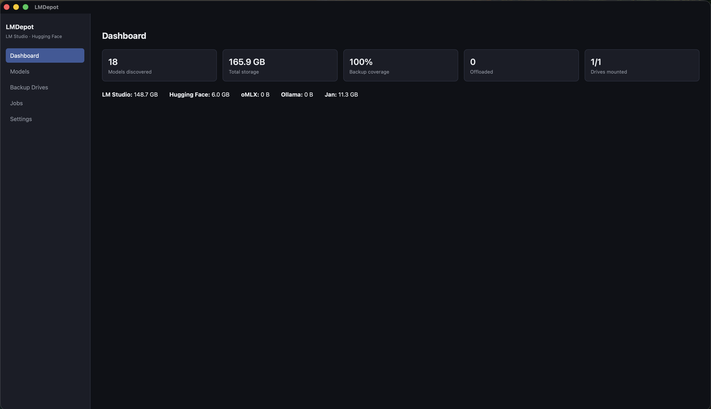
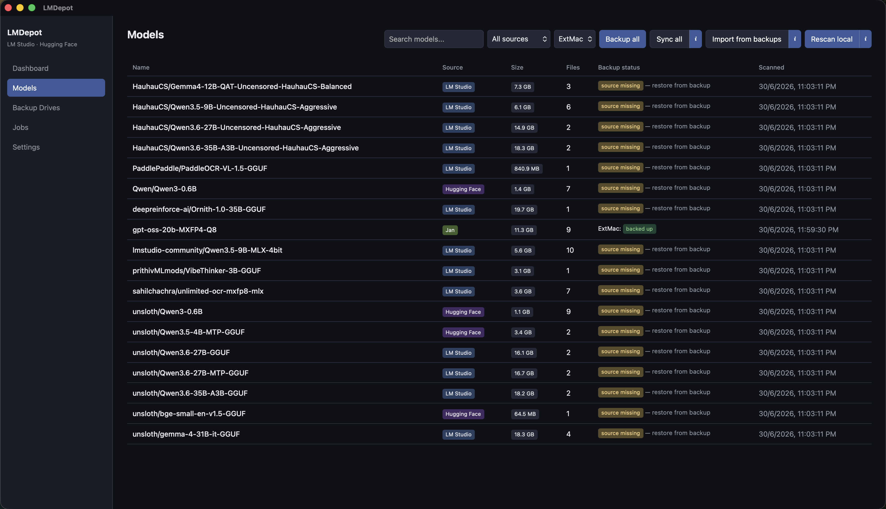
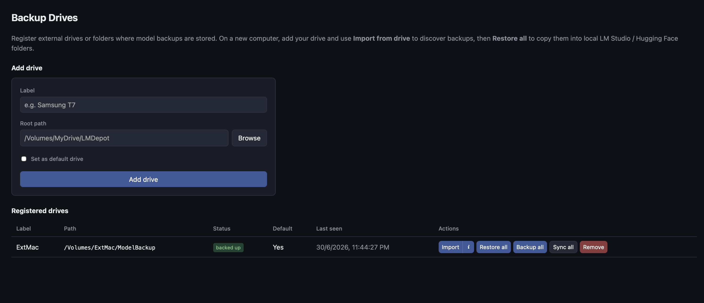

# LMDepot

Cross-platform desktop app for backing up AI models from **LM Studio** and the **Hugging Face Hub cache** to one or more external drives.

## Screenshots

Place PNG files in [`assets/screenshots/`](assets/screenshots/).

### Dashboard



### Models



### Backup drives



## Features

- **Discover models** from LM Studio (`~/.lmstudio`, `~/.cache/lm-studio`, or `.lmstudio-home-pointer`) and the Hugging Face Hub cache (`~/.cache/huggingface/hub`, or `HF_HUB_CACHE` / `HF_HOME`)
- **Register multiple backup drives** (external SSDs, NAS mounts, etc.)
- **Backup** — full copy to a selected drive with `model.manifest.json`
- **Sync** — copy only missing or changed files (size + mtime comparison)
- **Backup all / Sync all** — batch backup or sync every discovered model to a chosen drive (one job, sequential)
- **Restore** — copy from backup back to the original or a custom path
- **Import from backup drive** — scan external drives for `model.manifest.json` and register models (for new machines)
- **Restore all** — batch restore imported models from a drive to local folders
- **Delete** — remove from source only, backup only, or both (with confirmation)
- **Offload** — move model to external drive and leave a symlink/junction at the original path so apps keep working
- **Job progress** — background operations with live progress in the Jobs tab

## Stack

- **Tauri 2** + **Rust** backend
- **React + TypeScript** frontend
- **SQLite** for model inventory, drives, and job history

## Prerequisites

- [Node.js](https://nodejs.org/) 18+
- [Rust](https://www.rust-lang.org/tools/install)
- Platform deps for Tauri: https://tauri.app/start/prerequisites/

## Development

```bash
npm install
npm run tauri dev
```

## Build

```bash
npm run tauri build
```

Produces platform installers under `src-tauri/target/release/bundle/`.

## Tests

```bash
cd src-tauri && cargo test
```

## Default paths

| Source | Default location |
|--------|------------------|
| LM Studio | `~/.lmstudio/models` or `~/.cache/lm-studio/models` (see `~/.lmstudio-home-pointer`) |
| Hugging Face | `~/.cache/huggingface/hub` (or `HF_HUB_CACHE` / `HF_HOME`) |

Override paths in **Settings** if you relocated caches.

## Bulk backup / sync

On the **Models** page, pick a target drive from the dropdown and use **Backup all** or **Sync all** to process every discovered model in one background job.

On **Backup Drives**, each registered drive has **Import**, **Restore all**, **Backup all**, and **Sync all**. Progress appears in the **Jobs** tab.

## Restore on a new computer

1. Install LMDepot and connect your external drive.
2. Open **Backup Drives** → **Add drive** → set the root path to the folder that contains `lmstudio/` and `hf/` (see layout below).
3. Click **Import** on that drive — models appear on the **Models** tab with status *source missing*.
4. Click **Restore all** (or restore individual models) to copy files into local LM Studio / Hugging Face folders.
5. Open LM Studio or your HF tool — models should be available at the restored paths.

Override local paths in **Settings** if your caches are not in the default locations.

## Backup layout on external drives

```
/Volumes/MyDrive/LMDepot/
  lmstudio/
    author/Model-Name/
      model.manifest.json
      ...
  hf/
    org/Model-Name/
      model.manifest.json
      ...
```

Models from any HF Hub cache repo are discovered (e.g. `unsloth/...`, `meta-llama/...`).

## Safety notes

- Close **LM Studio** and **Hugging Face tools** (e.g. Unsloth, `huggingface-cli`) before delete/offload operations (configurable in Settings).
- HF cache backups copy whole snapshot directories as real files — do not manually edit HF blob stores.
- On Windows, offload uses directory junctions; enable Developer Mode or run as admin if junction creation fails.
- Unplugging a drive during a job fails cleanly; re-run sync after remounting.

## Roadmap (v2)

- OMLX, Ollama, direct HF API download (bypass cache)
- Custom folder watches
- Auto-sync on drive mount
- Optional cloud export via rclone/restic

## License

MIT
